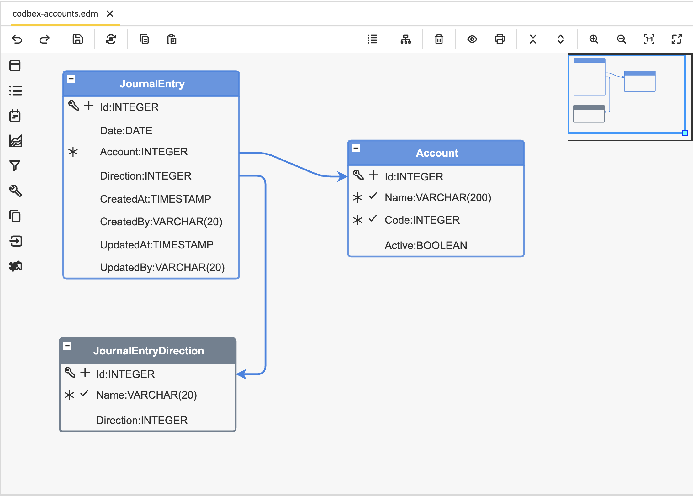

#  codbex-accounts

## 📖 Table of Contents
* [🗺️ Entity Data Model (EDM)](#️-entity-data-model-edm)
* [🧩 Core Entities](#-core-entities)
* [🔗 Sample Data Modules](#-sample-data-modules)
* [🐳 Local Development with Docker](#-local-development-with-docker)

## 🗺️ Entity Data Model (EDM)



## 🧩 Core Entities

### Entity: `Account`

| Field  | Type     | Details                    | Description                              |
|--------| -------- |----------------------------| ---------------------------------------- |
| Id     | INTEGER  | PK, Identity       | Unique identifier for the account.       |
| Name   | VARCHAR  | Length: 200, Unique, Not Null | Name of the account.                     |
| Code   | INTEGER  | Unique, Not Null                     | Code of the account.                     |
| Active | BOOLEAN  | Nullable                   | Indicates if the account is active.      |

### Entity: `JournalEntry`

| Field     | Type       | Details              | Description                              |
|-----------| ---------- |----------------------| ---------------------------------------- |
| Id        | INTEGER    | PK, Identity | Unique identifier for the journal entry. |
| Date      | DATE       | Nullable             | Date of the journal entry.               |
| Account   | INTEGER    | FK, Not Null         | Foreign key referencing the account.     |
| Direction | INTEGER    | FK, Nullable         | Foreign key referencing the direction.   |
| CreatedAt | TIMESTAMP  | Nullable             | Timestamp when the entry was created.    |
| CreatedBy | VARCHAR    | Length: 20, Nullable | User who created the entry.              |
| UpdatedAt | TIMESTAMP  | Nullable             | Timestamp when the entry was updated.    |
| UpdatedBy | VARCHAR    | Length: 20, Nullable | User who updated the entry.              |

### Entity `JournalEntryDirection`

| Field     | Type     | Details                   | Description                              |
|-----------| -------- | ------------------------- | ---------------------------------------- |
| Id        | INTEGER  | PK, Identity      | Unique identifier for the direction.     |
| Name      | VARCHAR  | Length: 20, Unique        | Name of the journal entry direction.     |
| Direction | INTEGER  | Nullable                  | Direction value for the journal entry.   |

## 🔗 Sample Data Modules

- [codbex-accounts-data](https://github.com/codbex/codbex-accounts-data)

## 🐳 Local Development with Docker

When running this project inside the codbex Atlas Docker image, you must provide authentication for installing dependencies from GitHub Packages.
1. Create a GitHub Personal Access Token (PAT) with `read:packages` scope.
2. Pass `NPM_TOKEN` to the Docker container:

    ```
    docker run \
    -e NPM_TOKEN=<your_github_token> \
    --rm -p 80:80 \
    ghcr.io/codbex/codbex-atlas:latest
    ```

⚠️ **Notes**
- The `NPM_TOKEN` must be available at container runtime.
- This is required even for public packages hosted on GitHub Packages.
- Never bake the token into the Docker image or commit it to source control.
